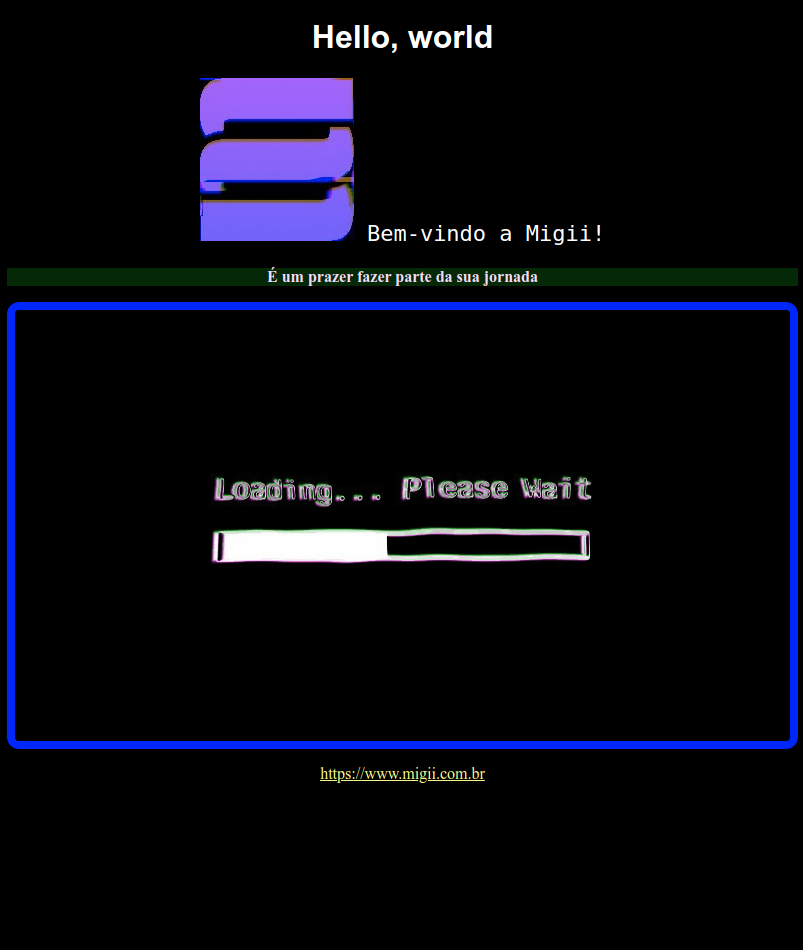

# Boss: Hello, Trojan!

## Boss description (Descrição do chefão)

### Specifications (Especificações)
  * Difficulty (Dificuldade): Nível Slime
  * Roadmap (Trilha): Front-end estático
  * Topics covered (Assuntos abordados): 
    * Primeiro website
    * Sintaxe HTML
    * Tags básicas
    * Sintaxe CSS
    * Seletores básicos
    * Formatação com CSS (cores, fontes, etc)

### Report (Relato)

Alguém andou baixando séries de sites russos e contaminou o computador com um [trojan](https://pt.wikipedia.org/wiki/Cavalo_de_troia_(computação)) 🤡.

Talvez com uma [engenharia reversa](https://pt.wikipedia.org/wiki/Engenharia_reversa) podemos descobrir mais sobre ele...

Crie uma cópia da página abaixo para entendermos melhor o Trojan!

## Tips (Dicas)
[Guia de estilos com cores, fontes e etc](./design/style-guide.md)

  

    Secrets (Segredos) (não veja antes de quebrar a cabeça um pouco)
  

  <ul>
    <li>Para acentos funcionarem, não se esqueça de configurar o <a href="https://developer.mozilla.org/en-US/docs/Glossary/character_encoding">charset</a> da sua página</li>
    <li>Utilize <a href="https://developer.mozilla.org/en-US/docs/Web/CSS/Class_selectors">classes CSS</a> para estilizar os dois parágrafos de diferentes maneiras</li>
    <li>Coloque uma <a href="https://developer.mozilla.org/en-US/docs/Web/HTML/Element/div">div</a> em volta da imagem de loading para centraliza-la utilizando a propriedade <code>text-align</code></li>
    <li><a href="https://codesandbox.io/s/boss-hello-trojan-tz14z?file=/index.html">Link da resolução</a></li>  
  </ul>

