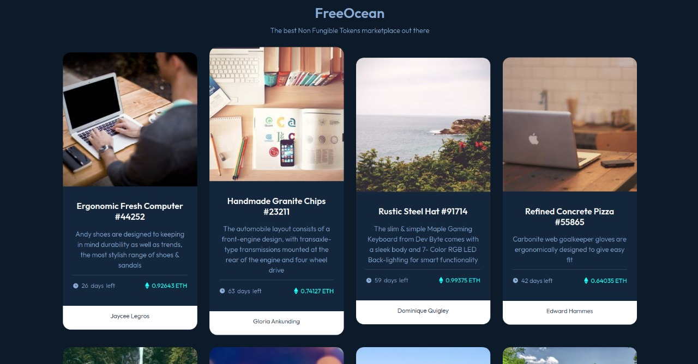

# Boss: FreeOcean

## Boss description (Descrição do chefão)

### Specifications (Especificações)
  * Difficulty (Dificuldade): Nível Spider Queen
  * Roadmap (Trilha): Frameworks Front-end
  * Topics covered (Assuntos abordados): 
    * Por quê React?
    * Ferramentas para buildar apps Front-end
    * Configuração inicial do React
    * JSX vs HTML
    * Componentes
    * Props

### Report (Relato)

Nossa equipe <del>viu um vídeo de 10 minutos no Youtube</del> estudou sobre <a href="https://en.wikipedia.org/wiki/Non-fungible_token">NFTs</a> e percebemos que um <a href="https://opensea.io">marketplace de NFT famoso</a> possui algumas falhas que podemos explorar.

Sua missão é criar um <a href="https://en.wikipedia.org/wiki/Minimum_viable_product">MVP</a> similar ao site famoso para testarmos a nossa hipótese.

[Versão interativa](https://v4qe9.csb.app/)

## Tips (Dicas)
[Guia de estilos com cores, fontes e etc](./design/style-guide.md)

  

    Secrets (Segredos) (não veja antes de quebrar a cabeça um pouco)
  

  <ul>
    <li>Você pode colar o código dos SVGs diretamente no seu código, como elementos HTML. Tome cuidado somente com os atributos dos mesmos, talvez no React eles tenham outro nome</li>
    <li>Tente procurar no console por erros. Alguns clássicos: usar <code>class</code> no lugar de <code>className</code></li>; não colocar a prop <code>key</code> em elementos renderizados a partir de uma lista
    <li>Usar <a href="https://developer.mozilla.org/en-US/docs/Web/JavaScript/Reference/Operators/Destructuring_assignment">desestruturação</a> para passar props de objetos é uma maneira mais fácil e polui menos o código</li>
    <li><a href="https://codesandbox.io/s/boss-free-ocean-v4qe9?file=/src/App.js">Link da resolução</a></li>  
  </ul>

